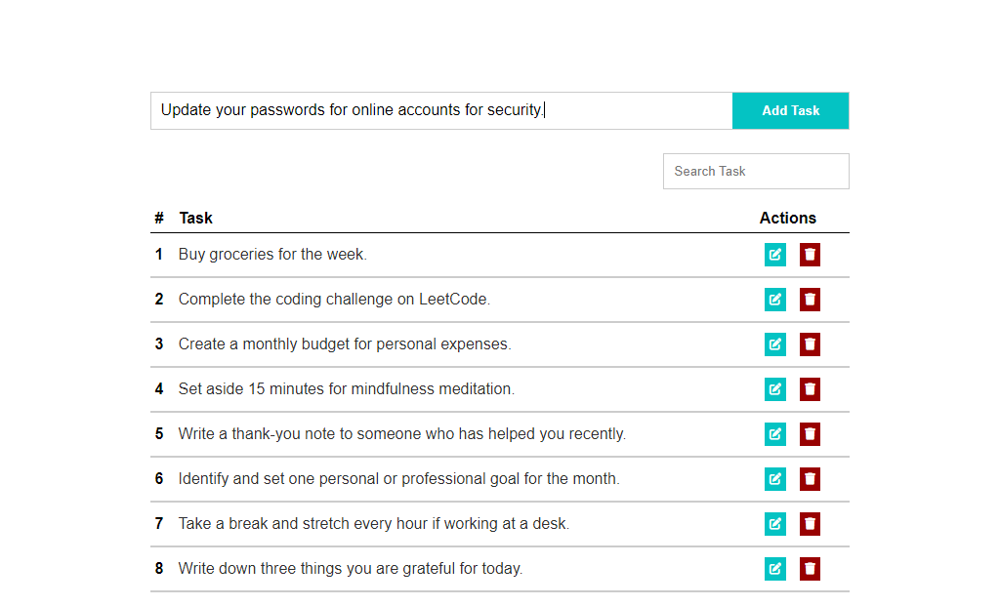

# Todo App

This simple Todo app allows users to manage their tasks by adding, editing, and deleting tasks. The app also features a search functionality to easily find tasks based on user input.

## Getting Started

1. Clone or download the repository to your local machine.
2. Open the `index.html` file in your preferred web browser.

## Features

### Add Task

To add a new task, enter the task details in the input field and click the "Add Task" button. The task will be added to the list.

### Edit Task

To edit a task, click the edit button (pencil icon) next to the task you want to modify. The task details will be populated in the input field, allowing you to make changes. Click "Save Changes" to update the task.

### Delete Task

To delete a task, click the delete button (trash icon) next to the task you want to remove. The task will be permanently deleted from the list.

### Search Tasks

Use the search bar to filter tasks based on keywords. As you type, the task list will dynamically update to display only the tasks that match the search criteria.

## Local Storage

The app utilizes local storage to persist tasks even after the browser is closed. This means that your tasks will be saved and loaded the next time you open the app.

## Contributing

Feel free to contribute to the development of this Todo app by submitting issues or pull requests. Your feedback and improvements are welcomed!

## Acknowledgments

- FontAwesome for providing free icons used in this application.
- The developers and contributors of JavaScript and HTML/CSS for the foundation of this web application.
